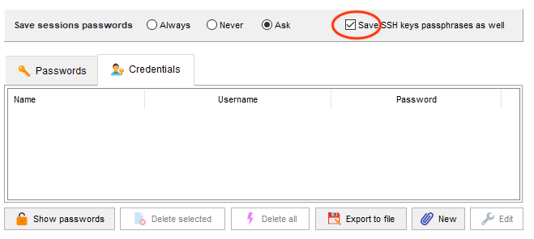
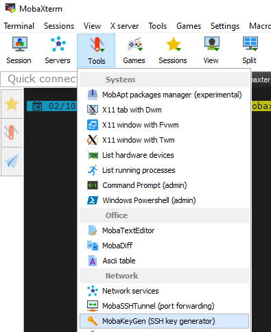
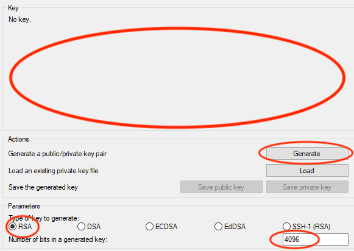

# SSH Keys

A key pair may be used in place of a password for SSH or SFTP authentication. This is a convenient and secure way to authenticate.

## Mac/Linux

Use the built-in ssh-keygen tool to generate your key pair.

```bash
ssh-keygen -t rsa -b 4096
```

You will be prompted save the key files. Press **Enter** to accept the default value.

```bash
Generating public/private rsa key pair.
Enter file in which to save the key (/Users/username/.ssh/id_rsa):
```

You will be prompted to enter a passphrase to save. Use a strong password with complexity and length.

```bash
Enter passphrase (empty for no passphrase):
Enter same passphrase again:
```

Add the new private key to your computer's list of keys. Your private key is the file without the **.pub** extension. You will be prompted for your passphrase.

```bash
ssh-add id_rsa
```

To complete this setup for cluster login, copy your public key to the cluster login node.

```bash
cat ~/.ssh/id_rsa.pub | ssh NetID@login-hpc.rcc.mcw.edu 'cat >> .ssh/authorized_keys
```

Test your setup by logging in to the cluster. A successful login should not prompt you for a password.

## Windows

### MobaXterm CLI

MobaXterm supports a similar functionality for Windows users. To generate a key pair, open MobaXterm and select `Start local terminal`.

Use the built-in ssh-keygen tool to generate your key pair.

```bash
ssh-keygen -t rsa -b 4096
```

You will be prompted save the key files. Press **Enter** to accept the default value.

```bash
Generating public/private rsa key pair.
Enter file in which to save the key (/Users/username/.ssh/id_rsa):
```

You will be prompted to enter a passphrase to save. Use a strong password with complexity and length.

```bash
Enter passphrase (empty for no passphrase):
Enter same passphrase again:
```

Copy your public key to the cluster login node.

```bash
cat ~/.ssh/id_rsa.pub | ssh NetID@login-hpc.rcc.mcw.edu 'cat >> .ssh/authorized_keys
```

To complete the setup, first logout of all shells and close MobaXterm. Open a new MobaXterm window and select **Session**. In the Session menu, select **SSH**. Enter the remote host, ***login-hpc.rcc.mcw.edu***. Select **Specify username** and enter your MCW username. Select **Use private key** and enter the private key you generated (should be automatic).

{ width="600" }

Select the icon to the right of the username field to open the **Password settings** window. Finally, select **Save SSH keys passphrases as well**, and close this window.

{ width="600" }

To test your setup, login by selecting **Ok**. Your first successful login should prompt you for your private key passphrase, but not your password. Subsequent logins should not prompt for either password.

### MobaXterm GUI

If you do not want to use command-line, try the `MobaKeyGen` tool in MobaXterm.

{ width="400" }

Adjust the default settings so that key type is **RSA**, and key length is **4096**. Select **Generate**, and move your mouse over the open space.

{ width="400" }

You should see key information. Enter an optional comment and a secure passphrase. Use a strong password with complexity and length. Lastly, save your public and private keys.

{ width="400" }

## Security

!!! danger "Private SSH Key"
    Treat your private key like a password. Do not share it with anyone. We will never ask you for your private key or your password.
