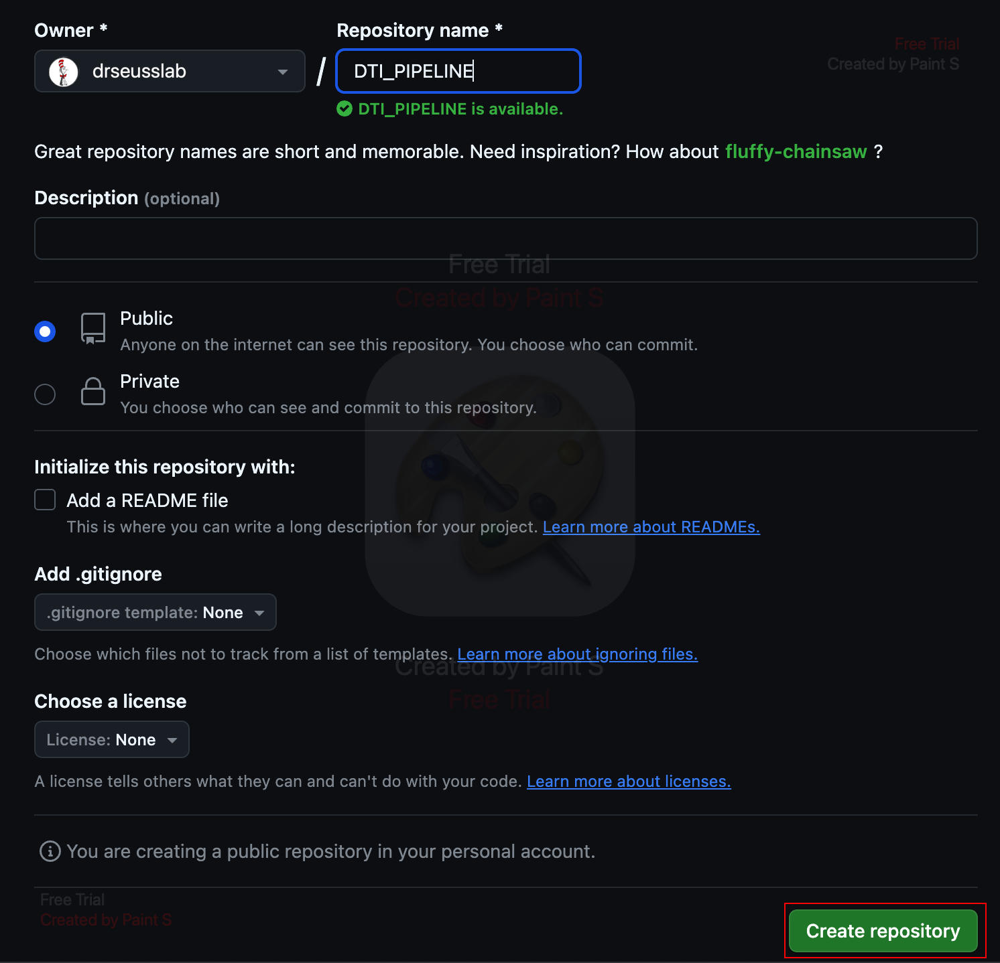
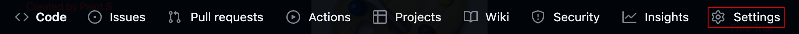

# Advanced Git and GitHub guide

In this advanced guide you will learn how to create a GitHub page to host lab documentation and share scripts, work with branches so that each person in your lab can independently edit the repository, resolve merge conflicts, and other concepts that you will need to know to keep your repository updated and collaborate with other members of your group. In order to follow this guide, it is a pre-requisite to have some basic knowledge in Git and GitHub. If you are new to these tools, please visit our [Beginners guide](git.md).

## Create a GitHub Page

### Create a GitHub Page for individual projects

We are going to start by creating a new repository where we will host the documentation for a research project. Log into your GitHub account (or the account that you created for your laboratory) and select the tab Repositories.


Then, click New.


Choose a suitable name for your repository and leave everything else as it is. Click on Create repository at the bottom of the page.



Clone your repository in your local computer. The URL of your project will be of the form https://github.com/username/projectname.git.

```bash
git clone https://github.com/drseusslab/DTI_PIPELINE.git
```

Now create an index.md or index.html file and any other files that will be part of the web page for your lab. Below is an example of what a very simple index.html file could look like. If you are new to Markdown or HTML, visit our [programming guide](programming.md) section where we have links to very good programming tutorials for different languages.

```html
<!DOCTYPE html>
<html>

        <title>DTI pipeline</title>

        <head>
                 <meta name="author" content="Dr. Seuss">
        </head>

        <body>
                <h2>DTI pipeline</h2>

                <p>In this page you will find information about our state of the art DTI processing pipeline.</p>
        </body>
</html>
```

Update your remote repository with the new file. In the example below, we first add index.html to the Staging Environment using `git add`. This is where Git stores the list of changes that you want to commit. You can add or remove things from this environment before doing a commit. We will learn more about it below in the section about [branches](#use-git-branches-to-edit-and-collaborate):

```bash
# Add all modified files to the Staging Environment
git add --all
# Commit all changes in the Staging Environment
git commit -m "created index file"
# This will synchronize the remote repository with the local changes
git push origin
```

Finally, enable GitHub Pages for the repository. Go to the repository on GitHub and click on Settings.



Under Code and automation, search for Pages. Then, in Build and deployment, under Source, select Deploy from a branch. And under Branch, select the main branch. Click on Save.


your site should be live at https://username.github.io/repository_name. Repeat this process for any individual projects.

### Create the main GitHub page for your lab

Now you can create the main page for your lab and add links to the individual project pages. The process is the same except that the name of the repository **must** be the same as your username. In our example, the repository must be named `drseusslab`. This main page will be hosted at https://username.github.io.

## Use Git Branches to edit and collaborate

Git branches allow you to create isolated spaces to develop new features, modify code or fix bugs without affecting your main line of development. When the code in the new branch is stable and finished, you can merge it with the main branch. Each repository can have multiple branches and you can switch between them easily. Remember that the `git` commands that you execute will modify the repository in which you are located. To change repository, navigate to the folder of the corresponding repository.

### Download the latest changes from the remote repository

Before creating a new branch, it is good idea to download the latest changes from the remote repository in order to avoid potential merge conflicts. You can first download the list of commits and changes that have been done in the remote repository using `git fetch`. This will not integrate those changes with your local repository, and will not modify your local files, it will just give you a view of what has happened in your remote repository.

```bash
# Download the changes in the remote repository
git fetch origin
# Visualize the status of the local repository compared to the remote
git status
```

If your main branch is up to date with `origin/master` (the remote repository in GitHub), you can safely create a new branch and proceed with the instructions on [how to create a new branch](#creating-a-new-branch). If your local repository is a few commits ahead and no commits behind, you can also continue working on it and merge all your changes when you're ready. If you are a few commits behind the remote branch, you can try to `pull` all changes from the remote repository in order to update the local. If there are no conflicts, your branch will be merged with the remote (locally) and you can now safely create a new branch and do any necessary edits to your code:

```bash
git pull origin
```

If there are any conflicts, you must resolve them manually before merging or creating a new branch. Please see the section below on [how to resolve conflicts](#resolve-merge-conflicts).

### Creating a new branch

```bash
# Create a new branch
$ git branch test
# See the list of branches in the current repository
# The current branch has an asterisk
$ git branch
* main
test
# Switch to my new branch
# Any edits that I do after this, will be created on the new branch
$ git checkout test
Switched to branch 'test'
$ git branch
  main
* test
```

You can create a new branch and switch to it in one command:

```bash
git checkout -b test2
```

### Updating your remote repository with the new branch

After editing your files, you can use `git status` to see the list of files that have been deleted, created or modified but not yet committed. At this point the changes are local and have not been updated in your remote repository. You might see a list of untracked files, these are those that are new (since the latest commit) and haven't been added yet to your remote repository. In order to commit any changes, you first must add them to the Staging Environment and then commit everything that is in this environment. The Staging Environment tells Git what you want to commit:

```bash
# Add all modified files to the Staging Environment
$ git add --all
# Add a specific file to the Stating Environment
$ git add myfile.txt
# Add a specific directory to the Stating Environment
$ git add mydirectory/
# Add a list of files to the Staging Environment
$ git add myfile1.txt myfile2.png myfile2.csv
# To remove a file from the Staging Environment
$ git reset HEAD myfile.txt
# Commit changes to your new branch
# Add a short message to explain the changes made
$ git commit -m "Added new functionality to the brain extraction script"
# Finally, you need to push your commit from the local repository to the remote one in GitHub
# This will synchronize both repositories
# origin is the name of your remote connection that points to the clone repository (see the remote add command in the previous section)
$ git push origin test
Enumerating objects: 5, done.
Counting objects: 100% (5/5), done.
Delta compression using up to 12 threads
Compressing objects: 100% (3/3), done.
Writing objects: 100% (3/3), 486 bytes | 486.00 KiB/s, done.
Total 3 (delta 2), reused 0 (delta 0), pack-reused 0
remote: Resolving deltas: 100% (2/2), completed with 2 local objects.
remote:
remote: Create a pull request for 'updates' on GitHub by visiting:
remote:      https://github.com/account/repository/pull/new/test
remote:
To https://github.com/account/repository.git
 * [new branch]      test -> updates
```

If you get an authentication error, make sure that your [personal access token](https://docs.github.com/en/authentication/keeping-your-account-and-data-secure/managing-your-personal-access-tokens){:target="_blank"} is not expired. After successfully running the `push` command, your new branch is updates in the remote repository. But remember that it is not yet merged with the main code. Once you are done with any edits, you can merge the branch.

### Merging my local branch with the main remote branch

If the repository belongs to you and you don't need to have anybody review the changes you have made, you are now ready to merge your local and remote branches and publish your updates.

```bash
# Switch to the main branch
$ git checkout main
Switched to branch 'main'
Your branch is up to date with 'origin/main'.
# Merge the current branch (main) with test
$ git merge test
# Master and test are merged, we can delete test
$ git branch -d test
Deleted branch test (was 5f4472c).
# If you haven't close the command line and decide you didn't want to delete the branch for some reason, you can restore it
$ git branch test 5f4472c
# Check the status of the local repository compared to the remote
$ git status
# Push the commit to synchronize the repositories
$ git push origin
```

On the other hand, if the repository doesn't belong to you or you have collaborators and you need them to check the changes you made before merging with the main branch, you should create a pull request. You can do this by following the link printed when you executed the `git push origin test` command. In this example, that would be `https://github.com/account/repository/pull/new/test`.

## Resolve merge conflicts

You must resolve all conflicts before you can successfully merge your branch with the base branch.

### Merge conflicts on specific files

You can use `git status` to see the list of files that have conflicts. If only a few files have conflicts and they arose because two developers did different edits on the same file, fixing those conflicts is relatively easy. Open each of those files in any editor and you will see the lines that have conflict. Between `<<<<<<< HEAD` and `=======` you will see the changes made in the base branch and between `=======` and `>>>>>>> other_branch` you will see the changes made in `other_branch`. Delete those conflict markers and make the final changes that you want to keep.

Then, add the changes to the staging environment, commit your changes and synchronize the local and remote repositories:

```bash
git add .
git commit -m "Resolved merge conflict"
git push origin
```

If the conflict arose because a file in one of the two branches was edited and in the other was removed, the solution is also simple. If you want to keep the files, add it back to your repository:

```bash
git add deleted_file.md
git commit -m "Resolved merge conflict by adding the file that was deleted"
git push origin
```

If you decide to remove the file from the repository:

```bash
git rm deleted_file.md
git commit -m "Resolved merge conflict by deleted the conflicting file"
git push origin
```

### Rebasing

If the main branch progressed since you started working on your current branch, you will be some commits ahead and some commits behind the main branch. In this case, it will be more complicated to fix the conflicts using the method above and you will need to rebase your branch. This will allow you to obtain the latest changes done to the main branch, while keeping the ones you did in your current branch. Rebasing is moving the starting point of the commits in your new branch, so that the base of those changes is an updated version of the main branch. For example, when you created your new branch it was up to date with the main branch, then you did two commits and want to merge those changes. But since you created the branch, the main one had three additional commits done from another member of your group. When you try to merge, there are conflicts. So, you rebase your branch so that your commits start after the three commits done on the main branch.


In order to rebase your new branch and put all the commits to the head of `origin` (the remote main branch), you would type the following commands:

```bash
# Make sure you have the correct branch activated (the one you want to rebase)
$ git branch
main
* new_branch
# Rebase to the head of the main remote branch (origin)
$ git rebase origin
```

You can rebase to any other branch, not necessarily has to be `origin`. However, It is not suggested to rebase if you already pushed your changes because it will modify your commit history. In that case, you will have to undo some of the changes you made or separate your branch in one or more branches. If you want to rebase some but not all of the commits, edit some of them, combine multiple commits or delete a commit, you can do an [interactive rebasing](https://git-scm.com/book/en/v2/Git-Tools-Rewriting-History){:target="_blank"}. You can find additional information about interactive rebasing in [this guide](https://docs.github.com/en/get-started/using-git/about-git-rebase).

### Undo changes

As merge conflicts get more complicated to resolve, you might need to [reset, checkout or revert](https://www.atlassian.com/git/tutorials/resetting-checking-out-and-reverting#:~:text=For%20this%20reason%2C%20git%20revert,is%20for%20undoing%20uncommitted%20changes.){:target="_blank"} some of the changes and commits that you did in your branch. [Moving some uncommited changes to a new branch](https://betterstack.com/community/questions/move-uncommited-work-to-new-branch/){:target="_blank"} is another option that would allow you to merge some of the changes that you made and separate the more complicated conflicts into a different branch. Finally, to investigate further all conflicts, you can [check the list of commits in the repository's history](https://www.freecodecamp.org/news/git-log-command/){:target="_blank"}.
