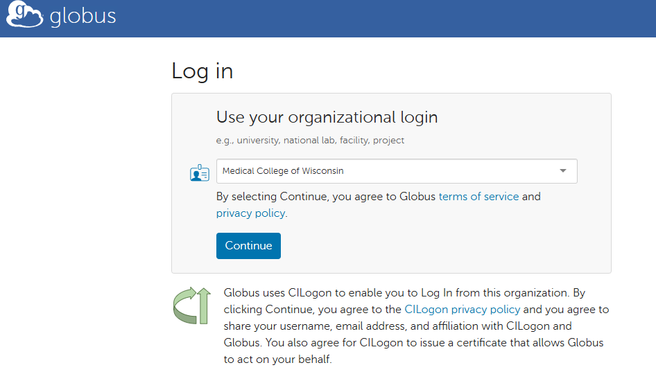
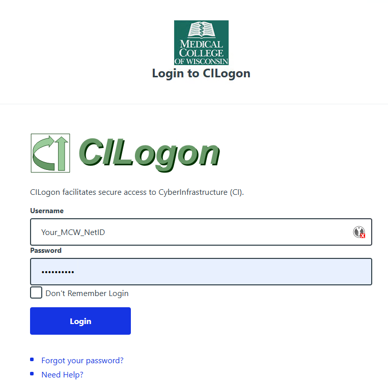
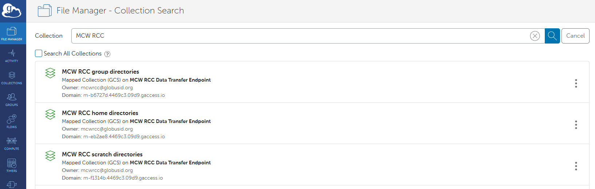
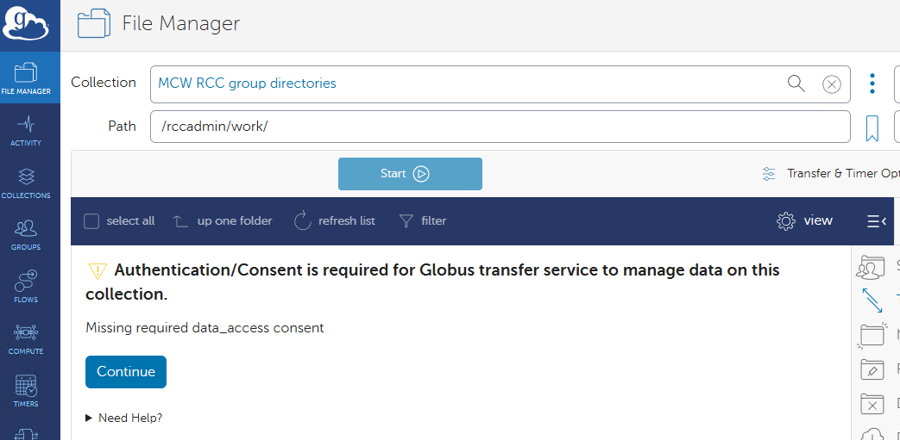
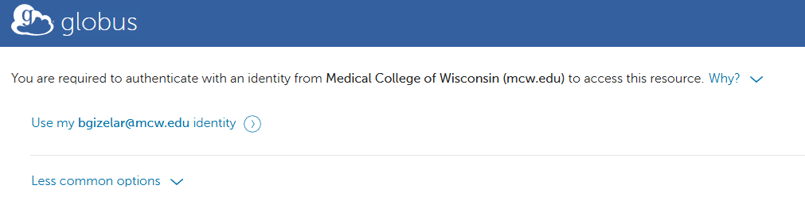

# Globus Connect Server (GCS) - MCW RCC Collections

MCW Research Computing Center provides **Globus Connect Server v5 (GCSv5)** mapped collections for fast, secure data transfer to and from RCC storage systems.  
These collections map directly to your RCC directories:

- **Home directories** (`/home/$USER`)
- **Group directories** (`/group/PI/work`)
- **Scratch directories** (`/scratch/g/PI`)

This guide walks you through logging in, finding the MCW RCC collections, and authorizing access the first time you use them.

---

## 1. Log in to Globus

1. Go to: <https://app.globus.org>{: target="_blank" }
2. Select **Medical College of Wisconsin** from the organizational login menu.
3. Click **Continue**.

---

## 2. Authenticate with MCW (CILogon)

You will be redirected to the MCW CILogon page.  
Log in using your **MCW NetID** and password.

Once authenticated, Globus will bring you to the **File Manager**.

---

## 3. Search for MCW RCC Storage Collections

Inside File Manager:

1. Click the **Collection** search bar.
2. Type: `MCW RCC`

You will see the three mapped RCC collections:

- **MCW RCC group directories**
- **MCW RCC home directories**
- **MCW RCC scratch directories**

These match your RCC storage locations and enforce Linux permissions exactly as on the HPC cluster.

---

## 4. Opening a Collection (Consent Required)

The first time you attempt to open one of the RCC collections, Globus will require **data access consent**.

You may see a message similar to:

> *Authentication/Consent is required for Globus transfer service to manage data on this collection.*

Click **Continue**.

---

## 5. Grant Access (Allow)

Globus will then ask for permission to:

✔ Manage data using Globus Transfer  
✔ Access the MCW RCC collection on your behalf  

Click on your MCW email address and then **Allow**.

After this, the collection will open normally.

---

## 6. Transferring Data

To begin transferring:

1. Open **Dual-Pane Mode** in the Globus File Manager.
2. Select a **Source** collection and a **Destination** collection.
3. Highlight files or folders.
4. Click **Start**.

Globus continues working even if you close the window or lose your connection.

---

## 7. Need Help?

If you cannot access a directory, or you believe permissions are missing:

📧 **{{ support_email }}**

For additional transfer methods also see:

- [File Transfer](file-transfer.md)
- [Globus Personal](globus.md)
- [Rclone](rclone.md)
