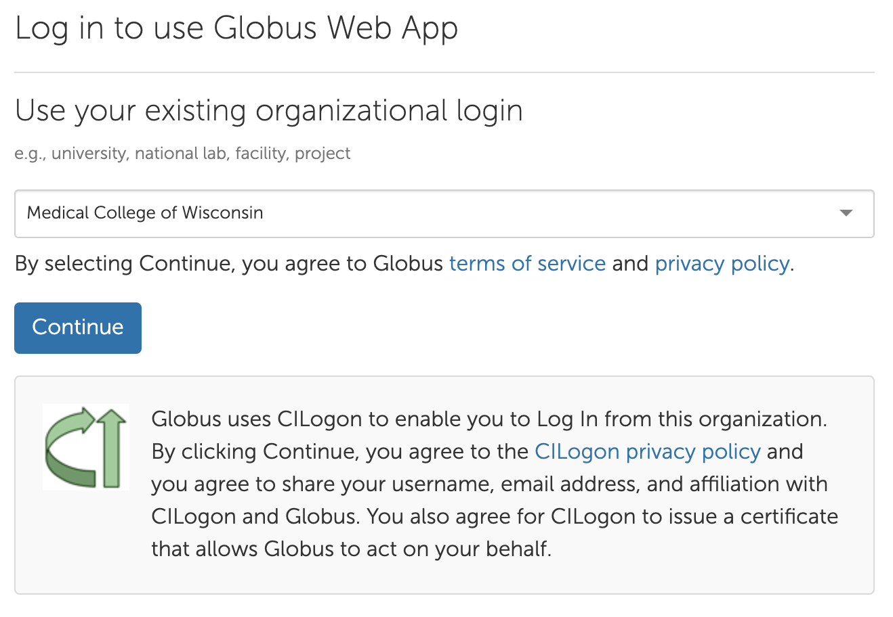

# Globus

Globus is a secure file transfer tool for research data. It is popular at research institutions and commonly deployed as a server. The unique features of Globus allow file transfer between MCW systems and between MCW and other schools. We are working on a central Globus Connect Server, but do not have a timeline yet. Here we present a work-around to transfer data between MCW and other institutions that do have Globus Connect Server.

!!! info "Globus @ MCW"
    RCC is working to deploy a Globus Connect Server. This future installation will simplify data movement inside and outside MCW. We do not yet have a firm date. Please contact {{ support_email }} with questions and stay tuned for updates.

## Setup

We will use Globus Connect Personal running on a cluster login node, which will allow transfer of data to/from storage locations on the cluster. This is a one-time setup with future sessions requiring only to start Globus.

To get started, open your browser to <https://app.globus.org/collections/gcp?generate_key>. You will be prompted to login and may have to create your account the first time. Select Medical College of Wisconsin from the drop-down menu and continue to login with your MCW credentials.

{ width="600" }

You will setup a new collection, i.e. endpoint. Enter a **Collection Display Name** that is memorable to you, e.g. "Cluster Dirs", and select **Generate Setup Key**.

{ width="600" }

!!! warning "As of 5/1/2024, we have identified an issue with Globus producing empty keys with the above step, and they have been notified and are working on the issue."
    The workaround is to create the collection and get the setup key via the globus CLI.  Run the following in a SSH session on a RCC cluster login node:
    ```bash
    module load globusconnect
    globus login
    globus gcp create mapped "Cluster Dirs"
    ```
The next step requires the cluster command-line. Make sure you have SSH access to a cluster login node. To proceed, load the Globus module and run the setup.

```bash
module load globusconnect
globusconnect -setup GLOBUS_KEY_HERE
```

If you see success, then you can start globusconnect.

```bash
globusconnect -start
```

Verify that you see successful startup. Before the next step, stop the process with Control-C.

We can add folder paths on the RCC by editing `~/.globusonline/lta/config-paths`.

```txt
/scratch/g/PI_NetID,0,1
/group/PI_NetID,0,1
```

Run the start command again and your folders will be accessible in the globusconnect application.

```bash
globusconnect -start
```

Don't forget to Control-C to disconnect/stop the session when you are done transferring data.

## Transfer data

Globus data transfer is controlled via web page. To get started, open your browser to <https://app.globus.org/file-manager>.

{ width="600" }

In the upper right corner, you can adjust your panel layout. When transferring data between endpoints, its easiest to select the side-by-side layout. Next you can search for your collections. Start by typing your MCW username into the left side collection box, which should find collections associated with you. Select the collection we created in previous steps. In the right side, enter your destination, which might be another school, or your desktop/laptop. We suggest you transfer data left to right to keep things simple.
