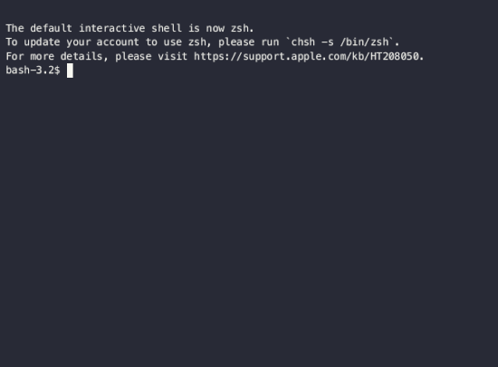

# Running Jobs

We use **SLURM** (Simple Linux Utility for Resource Management) for submitting, scheduling, and monitoring workloads, which we call jobs. Each job consists of resource requests and a set of commands to run. SLURM helps to schedule these jobs to run on the cluster using efficient methods to maximize throughput and minimize waiting. From the moment you submit a job, SLURM will make many decisions about priority of your workload, fair utilization of the cluster, and which resource is best to complete your job.

!!! tip "Clusters are shared resources."
    Please be respectful of all other users. Do not start resource-intensive scripts on a login node. Do not request more resources than your job can use. This would not only affect other users but will also affect the priority of your future jobs and the time your jobs stay in queue before they can run. For more info see [User Etiquette](../etiquette.md).

In this guide you will find some very basic information on how to write, submit and monitor a simple job. However, if you have the time or you need to submit more complex jobs, we suggest that you also review the [Advanced SLURM concepts guide](advanced_slurm_concepts.md). It will dive in more detail in some important concepts of running jobs in a cluster.

## The vi Editor

There are many available options to choose from when selecting an editor to write your scripts, but not all text editors are suitable for this. Many text editors, such as Microsoft Word or Note Pad introduce special characters that the compilers wont be able to interpret, this will cause your job to fail when submitted. The vi editor is a great choice because you can use it in the terminal when connected to the cluster and is available for most Operating Systems. This editor has a learning curve and if you have never used the Terminal before, you might find it hard to get used to at the beginning. In this case, please email us to {{ support_email }} and request a consultation, we will be able to help you get started with vi or recommend some other suitable editor depending on your operating system.

To create a new file using vi, you simply type vi followed by the name of your script. The vi editor will open in command mode, which is used to save, quit and perform other actions on the file. To start writing content on the file, you must change to typing mode. To do this, type the letter `a` in your keyboard. Now you can start writing your script. To save any changes, go back to command mode by pressing the `esc` key and then `:w` (for **w**rite). To continue typing, go back to typing mode by pressing `a` again. To save and quit the vi application, go to command mode, then type `:wq` (for **w**rite and **q**uit). The following video shows how to do this. You can learn more about the vi editor in this [Bash Tutorial](https://monicagiraldochica.github.io/bash.html){:target="_blank"}, in the section of "Creating simple bash scripts".



## Writing a Job Script

A job script tells the scheduler what resources are required to run a specific set of workload commands. It is a text file using shell script syntax, denoted by the required first line, `#!/bin/bash`. It can be broken into two sections; **resource requests** and **executable commands**. Each section will be explained using the following example SLURM job script that can be used as a starting template for your jobs. In this example, the file name is test-job.slurm. You could also use the .sh extension.

Here we show the most common options to include in the heather, however, there are many more options that you could add to further personalize how and when your script executes. Visit the official [SLURM sbatch guide](https://slurm.schedmd.com/sbatch.html){:target="_blank"} for a list of all possible options.

=== "test-job.slurm"

```txt
#!/bin/bash
#SBATCH --job-name=test-job
#SBATCH --time=00:01:00
#SBATCH --account=PI_NetID
#SBATCH --ntasks=1
#SBATCH --cpus-per-task=1
#SBATCH --mem-per-cpu=1gb
#SBATCH --partition=normal
#SBATCH --output=%x-%j.out
#SBATCH --mail-type=ALL
#SBATCH --mail-user=NetID@mcw.edu

echo "Starting at $(date)"
echo "Job name: ${SLURM_JOB_NAME}, Job ID: ${SLURM_JOB_ID}"
echo "I have ${SLURM_CPUS_ON_NODE} CPUs on compute node $(hostname -s)"
```

### Resource Requests

This section is comprised of `#SBATCH` directives that tell the scheduler what resources you're requesting. Some of the directives are required, as noted below. While more than one directive can be combined on a single line, RCC does recommend a separate line for each.

#### Job Name

A job name is **required** and is set with the `#SBATCH --job-name=` option. Your job will appear in the queue with this name and job output files may be based on it. Letters, digits, underscore, and hyphens are allowed. Try to keep the name short.

#### Time

A time request is **required** and tells SLURM how long your job will run. The `--time` flag sets the max time, in DD-HH:MM:SS, that your job can run. If your job exceeds that time limit, it will fail with a WALL TIME error message. In this case, just increase the wall time and re-submit your job. Do not request too much more time than you think your job would take, you would be wasting resources and it will sit in queue for longer before it can run.

SLURM is also configured with default and max time limits. See [Resource Limits](advanced_slurm_concepts.md/#job-scheduling-policies) for more information on time limits.

For, example, to reserve one minute for the job to run:

```txt
#SBATCH --time=00:01:00
```

To reserve one hour:

```txt
#SBATCH --time=01:00:00
```

To reserve one day:

```txt
#SBATCH --time=01-00:00:00
```

!!! tip "Does your job require more than the maximum 7 day time limit?"
    Email the jobid number and time extension request to {{ support_email }} as soon as possible after the job is submitted (the job must still be running for us to be able to extend the time).

#### Account

An account is **required** for your job to run. The `--account` option should be set to your PI's NetID, or the NetID of a collaborator PI. If you need to adjust your account membership, please contact RCC.

!!! tip "You can easily find your accounts with the `myaccts` command."

    <!-- markdownlint-disable MD046 -->
    ```bash
    $ myaccts
    Account        Partition
    pi             bigmem,dev,gpu,normal
    ```
    <!-- markdownlint-enable MD046 -->

#### Tasks and CPUs per task

SLURM uses the concept of tasks, which are processes that can use one or more CPU cores to run a copy of a program. The number of processes or tasks is indicated with `--ntasks` and the number of CPUs or threads per task is indicated with `--cpus-per-task`. Most applications run sequentially, using only one task and one CPU. In this case, these two options should have value 1. If your application mentions multi-thread, multi-core, or MPI, you will need to modify these values. The [advance guide](advanced_slurm_concepts.md/#nodes-cores-tasks), explains how to choose the values of these options for jobs that use parallelism.

Other CPU resources not mentioned in the example are `--nodes` and `--ntasks-per-node`. You will also find more information about these in the [advance guide](advanced_slurm_concepts.md/#nodes-cores-tasks). However, even in parallel jobs, it is very rare that `--nodes` and/or `--ntasks-per-node` have a value greater than 1.

A CPU resource request is **required** and you must use at least one of the following options: `--nodes`, `--ntasks-per-node`, `--ntasks`, `--cpus-per-task`.

#### Memory

A memory request is **required** and tells the job scheduler how much memory to allocate to processes. SLURM has default- and maximum-memory-per-core settings. See [Resource Limits](advanced_slurm_concepts.md/#job-scheduling-policies) for more information on memory settings. A memory request is done with the use of `--mem` or `--mem-per-cpu` flags. `--mem` will indicate the total memory while `--mem-per-cpu` will indicate the amount of memory needed by each thread running on a different CPU (total memory requested = `--mem-per-cpu` x number_of_cpus_requested). In the case of single-thread (sequential) jobs, they would be equivalent since there's only one CPU. If your job is multi-thread or MPI, please use the `--mem-per-cpu` flag. Your job will fail if your application exceeds the memory you requested, or the total available memory.

#### Partition

A partition is not required but can be added with `#SBATCH --partition=`. The partition flag is only needed if requesting complex resources, such as the large memory or GPU nodes, and the default value is `normal`. If you need to use a large memory or GPU node, please review the [partitions](advanced_slurm_concepts.md/#partitions) section in the advanced guide. You will need to use the large memory partition if your job failed because it ran out of memory and you already requested the maximum available for the normal partition.

#### Job Output

A job output flag is not required. By default SLURM will send job output to `slurm-%j.out` in the working directory, where `%j` is the SLURM jobid. If the `--output` flag is used, SLURM will output the application's STDOUT to the given filename. In our example script, SLURM output is sent to `%x-%j.out`, where `%x` is the job name.

#### Notifications

Notifications are **optional** and can be sent from the job scheduler to an email address of your choice. Many types are supported, but common options include when a job begins `#SBATCH --mail-type=BEGIN`, when a job ends `#SBATCH --mail-type=END`, and when a job fails `#SBATCH --mail-type=FAIL`. Options may be combined, i.e. `#SBATCH --mail-type=BEGIN,END`. There is also an option to send all notifications `#SBATCH --mail-type=ALL`. The recipient email is specified with `#SBATCH --mail-user=NetID@mcw.edu`. RCC recommends using notifications during job debugging. Adding notifications as a default may result in email spam, especially if you're submitting many jobs. In that case, it's easier to [monitor your jobs](#monitor-your-job) through the command line.

### Executable commands

The executable commands section follows the job request section and begins with the first non `#SBATCH` line. Executable commands commonly include module loads, file I/O, software commands, and directory cleanup.

In the example job script, executable job commands include several environment variables that are created by SLURM when your job starts. These can be useful to automate tasks or print helpful information about your job to your output file:

```bash
echo "Starting at $(date)"
echo "Job name: ${SLURM_JOB_NAME}, Job ID: ${SLURM_JOB_ID}"
echo "I have ${SLURM_CPUS_ON_NODE} CPUs on compute node $(hostname -s)"
```

If your script includes commands that need a module to be loaded, do it the same way you would do it in the Terminal of a login node, with `module load app_name`. It is good practice to load all the modules that you will need at the beginning of this section. If your job fails with an error that contains `command not found`. It is most likely because you missed loading some module.

## Managing Job Input/Output Files

Now that you finished writing your job script and is ready to be submitted, you need to make sure that the files used within the script are available at run time. All the input files must be in your scratch and all the output files need to be saved there too. During execution, your job won't have access to your group directory.

The HPC cluster requires a specific job workflow:

1. Copy job input/supporting files from your RGS directory within `/group/PI_NetID/...` to your scratch directory `/scratch/g/PI_NetID`
2. Submit a job from your `/scratch/...` directory that utilizes the staged job input/supporting files. **You must make sure the job I/O runs in your scratch directory.** The easiest way is to run the sbatch command in your `/scratch/...` directory.
3. When job finishes, copy results from `/scratch/...` back to `/group/PI_NetID/`....
4. If there are further computations, continues utilizing the job input/supporting files
5. When jobs are finished and staged job input/supporting files are no longer needed, delete the job input/supporting files from `/scratch/...`

!!! warning
    Your jobs will fail if you do not follow this procedure. Please note that files in `/scratch/...` that are older than 180 days will be deleted.

## Submit your job

Now that you finished your script and have all the input files available, it is time to submit your job. A batch job is submitted with the `sbatch` command. This is the best method for production job as it allows you to submit many jobs and let SLURM do the work. With a batch job, there is no requirement that you sit and watch the command-line. You can submit the job and come back later.

```bash
sbatch test-job.slurm
```

Once you submit your job it will print the jobID. Then, you can either [monitor your job](#monitor-your-job) through the command line or wait to receive any notifications by email if you used the email flags.

## Monitor your job

These are some common batch commands that you can use to monitor your jobs:

List your queued and running jobs:

```bash
squeue -u NetID # NetID is your network ID or username
```

Show information about a running job:

```bash
squeue -j jobId # jobId is the job number
```

Cancel a queued job or stop a running job:

```bash
scancel jobId # jobId is the job number
```

Show history of job:

```bash
sacct -j jobId # jobId is the job number
```

## Submit an Interactive Job

You may need an interactive session for debugging in case your job is failing and the log file is not providing enough information. An interactive job is submitted with the `srun` command. All of the SLURM options that are required in job scripts are required with the `srun` command in addition to `--pty bash`.

```bash
srun --ntasks=1 --mem-per-cpu=4GB --time=01:00:00 --job-name=interactive --account=PI_NetID --pty bash
```

To stop your interactive job, use the `exit` command.

```bash
exit
```

!!! tip "Open OnDemand"
    We encourage all users to make use of [Open OnDemand](https://ondemand.rcc.mcw.edu/){:target="_blank"} for interactive sessions.

## Job Scheduling and Maintenance

If you submit a job before a maintenance window and the job is sitting in the queue, first check to see why with `squeue`. In the output, you'll see the last column `NODELIST(REASON)`. If your job is held for maintenance, you'll see `(ReqNodeNotAvail, Reserved for maintenance)`.

Each job has a [walltime request](#time). The walltime request sets the amount of time that your job will be allowed to run on the cluster. On the HPC cluster, the maximum allowed walltime is 7 days.

If you submit your job with X hours walltime request, and the maintenance window starts in less than X hours, the job will be held until after the maintenance window closes. The reason is that the scheduler cannot guarantee your job will finish before maintenance begins.

To make the job run, resubmit your job with a walltime request that ensures the job will finish before the maintenance window. We can use a simple formula to find that walltime.

`walltime = ( $maint_start_time - $current_time )`

To simplify the process, use the `maxwalltime` command, which provides the maximum walltime request that will also allow your job to run before maintenance.

!!! info
    Please note, RCC schedules maintenance windows every first Wednesday of the month from 9PM-12AM.

--8<-- "includes/abbreviations.md"
